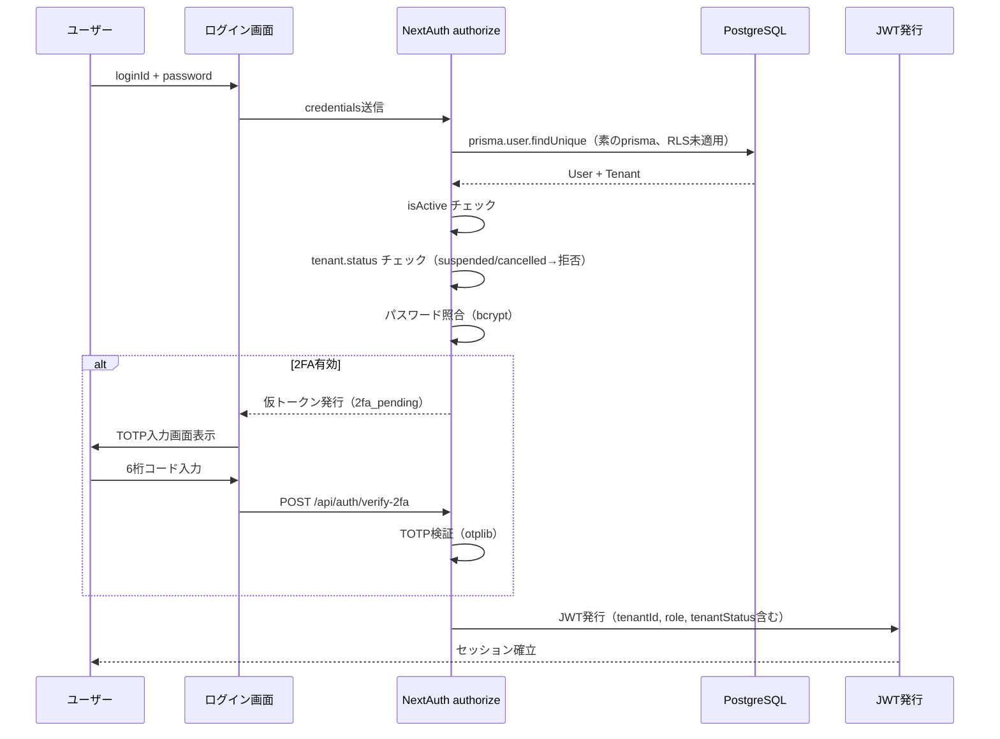
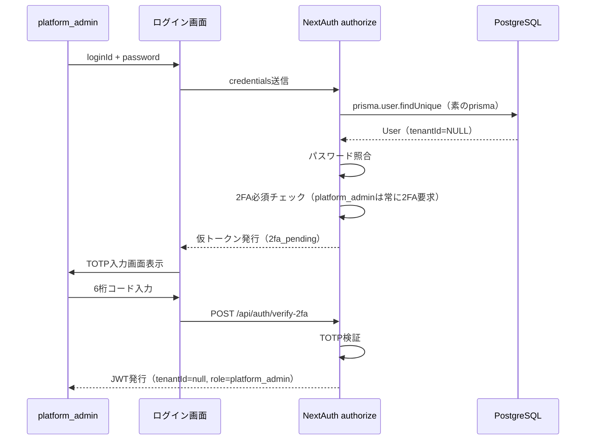
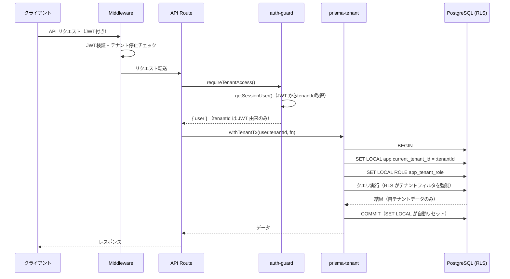
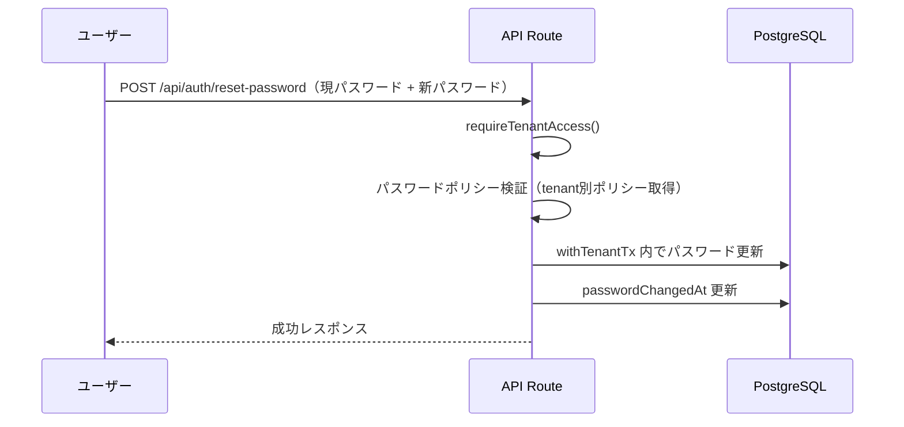
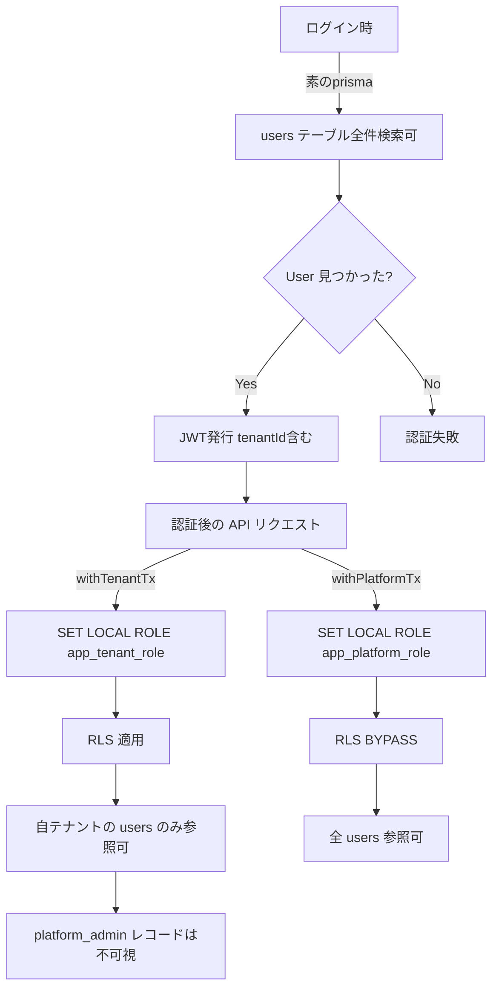

# テナント認証・認可 設計書

## 1. 認証フロー変更

### 1.1 現状

```
ログイン画面 → loginId + password → NextAuth authorize → JWT発行
```

### 1.2 変更後

```
ログイン画面 → loginId + password → NextAuth authorize
  → User取得 → テナントステータス確認 → JWT発行（tenantId, role含む）
```

ログインIDはシステム全体でユニークとする（テナント横断）。
テナントIDはログインフォームに入力させず、ユーザーテーブルから自動解決する。

**理由:** テナントIDの手入力はUXが悪く、テナントスラッグの露出もセキュリティ上望ましくない。

### 1.3 ログイン時のチェック順序

1. `loginId` で User を検索
2. User が存在しない → 認証失敗
3. `user.isActive === false` → 「このアカウントは無効です」
4. `user.tenantId !== null` の場合、テナントを取得
5. `tenant.status === "suspended"` → 「このアカウントは現在利用できません」
6. パスワード照合 → 不一致なら認証失敗
7. 2FA が有効な場合 → TOTP入力画面へ遷移（後述）
8. JWT 発行

**重要:** ログイン時の User 検索は RLS 適用前のシステムコンテキストで実行する。
`authorize` 関数内では素の `prisma` を使用する（`withTenantTx` は使わない）。
認証成功後、テナントスコープの操作から `withTenantTx` を使用する。

---

## 2. JWT ペイロード拡張

### 2.1 現在の JWT payload

```typescript
{
  id: string;
  loginId: string;
  role: string;  // "admin" | "sales"
}
```

### 2.2 変更後の JWT payload

```typescript
{
  id: string;
  loginId: string;
  role: string;       // "platform_admin" | "tenant_admin" | "sales"
  tenantId: number | null;  // platform_admin は null
  tenantStatus: string;     // "active" | "suspended" (テナント所属時)
  authVersion: number;      // ユーザー権限バージョン（権限変更時にインクリメント）
}
```

**authVersion の用途:** JWT 情報は永続権限ソースとして扱わない。
`authVersion` が User テーブルの値と一致しない場合、セッションを即時失効させる。

### 2.3 next-auth.d.ts の型拡張

```typescript
import "next-auth";

declare module "next-auth" {
  interface Session {
    user: {
      id: string;
      name: string;
      loginId: string;
      role: string;
      tenantId: number | null;
      tenantStatus: string | null;
      authVersion: number;
    };
  }
}

declare module "next-auth/jwt" {
  interface JWT {
    id: string;
    loginId: string;
    role: string;
    tenantId: number | null;
    tenantStatus: string | null;
    authVersion: number;
  }
}
```

---

## 3. NextAuth 設定変更

### 3.1 authorize 関数

```typescript
async authorize(credentials) {
  if (!credentials?.loginId || !credentials?.password) return null;

  // ログイン時は素の prisma を使用（RLS 適用前、withTenantTx 不使用）
  const user = await prisma.user.findUnique({
    where: { loginId: credentials.loginId },
    include: { tenant: true },
  });

  if (!user || !user.isActive) return null;

  // テナント所属ユーザーの場合、テナント状態チェック
  if (user.tenantId && user.tenant) {
    if (user.tenant.status === "suspended") return null;
    if (user.tenant.status === "cancelled") return null;
  }

  const isPasswordValid = await compare(credentials.password, user.passwordHash);
  if (!isPasswordValid) return null;

  return {
    id: String(user.id),
    name: user.name,
    loginId: user.loginId,
    role: user.role,
    tenantId: user.tenantId,
    tenantStatus: user.tenant?.status ?? null,
    authVersion: user.authVersion,
  };
}
```

### 3.2 JWT コールバック

> **位置づけ:** JWT callback での authVersion チェックは**補助キャッシュとしての早期検出**である。
> 最終的な権限判定は認可 helper（§5.4）で DB 再確認する。

```typescript
async jwt({ token, user }) {
  if (user) {
    token.id = user.id;
    token.loginId = (user as any).loginId;
    token.role = (user as any).role;
    token.tenantId = (user as any).tenantId;
    token.tenantStatus = (user as any).tenantStatus;
    token.authVersion = (user as any).authVersion;
  }

  // セッション更新時に authVersion + テナントステータスを再チェック
  const dbUser = await prisma.user.findUnique({
    where: { id: Number(token.id) },
    select: { authVersion: true, isActive: true, tenant: { select: { status: true } } },
  });

  // authVersion 不一致 or ユーザー無効化 → セッション失効（再ログイン強制）
  if (!dbUser || !dbUser.isActive || dbUser.authVersion !== token.authVersion) {
    return null;
  }

  // テナントステータスの即時反映
  if (token.tenantId && dbUser.tenant) {
    token.tenantStatus = dbUser.tenant.status;
  }

  return token;
}
```

**注意:** JWTコールバックでのDB問い合わせはリクエストごとに実行される。
テナントステータスのキャッシュ（インメモリ TTL 60秒）を将来的に導入する余地を残す。
初期実装では許容する（テナント停止は頻繁でない操作のため）。

**authVersion をインクリメントするタイミング:**

- role 変更時
- tenant 変更時（テナント間移動等）
- ユーザー無効化時
- テナント停止時（テナント内全ユーザーの authVersion を一括インクリメント）

これにより、権限変更後は既存セッションが即座に失効し、再ログインが強制される。

---

## 4. Middleware 変更

### 4.1 現在の middleware

- 未認証 → /login へリダイレクト
- /admin/* → admin ロールのみ

### 4.2 変更後の middleware

```typescript
export async function middleware(request: NextRequest) {
  const token = await getToken({ req: request });
  const { pathname } = request.nextUrl;

  // 1. ログインページは未認証でもアクセス可
  if (pathname === "/login") {
    if (token) return NextResponse.redirect(new URL("/customers", request.url));
    return NextResponse.next();
  }

  // 2. API認証ルートはスルー
  if (pathname.startsWith("/api/auth")) return NextResponse.next();

  // 3. 未認証 → ログインページへ
  if (!token) {
    const loginUrl = new URL("/login", request.url);
    loginUrl.searchParams.set("callbackUrl", pathname);
    return NextResponse.redirect(loginUrl);
  }

  // 4. テナント停止チェック（テナント所属ユーザーのみ）
  if (token.tenantId && token.tenantStatus === "suspended") {
    if (pathname.startsWith("/api/")) {
      return NextResponse.json(
        { error: { code: "TENANT_SUSPENDED", message: "テナントが停止されています" } },
        { status: 403 }
      );
    }
    const loginUrl = new URL("/login", request.url);
    loginUrl.searchParams.set("error", "tenant_suspended");
    return NextResponse.redirect(loginUrl);
  }

  // 5. platform_admin 専用ページ
  if (pathname.startsWith("/platform") && token.role !== "platform_admin") {
    return NextResponse.redirect(new URL("/customers", request.url));
  }

  // 6. tenant_admin 専用ページ（/admin/*）
  if (pathname.startsWith("/admin") &&
      token.role !== "tenant_admin" &&
      token.role !== "platform_admin") {
    return NextResponse.redirect(new URL("/customers", request.url));
  }

  return NextResponse.next();
}
```

---

## 5. テナント分離の多層防御実装

### 5.1 設計原則

テナントデータ分離は **二重防御 + 補助策** で実現する。Prisma Client Extensions だけに依存しない。

| レイヤー | 手段 | 実装ファイル | 役割 | 標準実装に含むか |
|---------|------|------------|------|:---:|
| Layer 1 | 認可 helper + API ルート | src/lib/auth-guard.ts + 各 route.ts | 明示的な tenantId 検証 + 明示的 where 句 | **必須** |
| Layer 2 | PostgreSQL RLS | マイグレーション SQL | 最終防衛線 | **必須** |
| 補助 | Prisma Client Extensions | src/lib/prisma-tenant.ts | クエリ自動注入（追加安全策） | 任意 |

**標準実装パターン:** `requireTenantAccess()` + `withTenantTx(tenantId, fn)` 内での明示的 `where` + RLS。
Extensions がなくても Layer 1（認可 helper + 明示的 where）+ Layer 2（RLS）で二重防御が成立する。

### 5.2 Layer 1: テナントコンテキスト設定 — `withTenantTx` / `withPlatformTx`

**重要:** 旧設計の `getTenantPrisma()` / `getPlatformPrisma()` / `resetPrismaRole()` は**廃止**する。
`SET`（セッションスコープ）は コネクションプール汚染のリスクがあるため使用禁止。
全てのテナントスコープ DB 操作は `withTenantTx` または `withPlatformTx` 経由で実行する。

```typescript
// src/lib/prisma-tenant.ts

import { Prisma } from "@prisma/client";
import { prisma } from "./prisma";

/**
 * テナントコンテキスト付きトランザクションを実行する。
 * SET LOCAL により、トランザクション終了時に自動でコンテキストがリセットされる。
 * コネクションプール汚染のリスクなし。
 *
 * 使用ルール:
 * - 全てのテナントスコープ DB 操作はこの関数経由で実行すること
 * - tenantId は必ず authContext（JWT）から取得すること
 * - リクエストボディ/クエリ/Cookie/ヘッダーから tenantId を受け取ってはならない
 */
export async function withTenantTx<T>(
  tenantId: number,
  fn: (tx: Prisma.TransactionClient) => Promise<T>
): Promise<T> {
  // tenantId の安全性検証（共通ラッパー内部でのみ $executeRawUnsafe を使用）
  if (!Number.isInteger(tenantId) || tenantId <= 0) {
    throw new Error(`Invalid tenantId: ${tenantId}`);
  }
  return prisma.$transaction(async (tx) => {
    // $executeRawUnsafe の使用はこの共通ラッパー内部に限定。
    // SET LOCAL はパラメータ化クエリに対応していないため、
    // 文字列補間を使用するが、上記バリデーションで正の整数であることを保証済み。
    // commit/rollback で自動リセット。手動での RESET は不要。
    await tx.$executeRawUnsafe(
      `SET LOCAL app.current_tenant_id = '${tenantId}'`
    );
    await tx.$executeRawUnsafe(`SET LOCAL ROLE app_tenant_role`);
    return fn(tx);
  });
}

/**
 * platform_admin 用: RLS バイパスのトランザクション。
 * platform_admin は BYPASSRLS 権限を持つ app_platform_role で実行する。
 *
 * 使用ルール:
 * - platform_admin の API ルート（/platform/*）でのみ使用すること
 * - テナント側 API ルート（/api/customers 等）では使用しないこと
 * - 操作対象テナントの tenantId は /platform/tenants/:tenantId/* のパスパラメータから取得
 */
export async function withPlatformTx<T>(
  fn: (tx: Prisma.TransactionClient) => Promise<T>
): Promise<T> {
  return prisma.$transaction(async (tx) => {
    await tx.$executeRawUnsafe(`SET LOCAL ROLE app_platform_role`);
    return fn(tx);
  });
}
```

**`SET LOCAL` を採用する理由:**

| 比較項目 | `SET`（セッションスコープ） | `SET LOCAL`（トランザクションスコープ） |
|---------|--------------------------|--------------------------------------|
| スコープ | コネクション全体 | トランザクション内のみ |
| リセット | 手動で `RESET` が必要 | commit/rollback で自動リセット |
| コネクションプール | 汚染リスクあり（次のリクエストに影響） | **汚染リスクなし** |
| リセット忘れ | 致命的セキュリティリスク | **発生しない** |
| 並行リクエスト | コンテキスト混在のリスク | **完全に分離** |

### 5.3 Prisma Client Extensions（補助的手段 — 標準実装には含めない）

Prisma Client Extensions は `withTenantTx` 内で追加の安全層として機能する。
Extensions が正しく機能しなくても、RLS が最終防衛線として機能する。

**位置づけ:**
- Extensions は**標準実装パターンには含めない**
- 実運用の標準は `requireTenantAccess()` + `withTenantTx(tenantId, fn)` 内での明示的 `where` + RLS
- Extensions は「追加したい場合の補助策」として位置づける
- Extensions がなくても RLS + 明示的 where で二重防御が成立する

```typescript
// src/lib/prisma-tenant.ts（続き）

/**
 * テナントスコープの Prisma Extensions を返す。
 * withTenantTx 内で使用する補助的手段。
 * Extensions はクエリに tenantId を自動注入するが、
 * 万が一バイパスされても RLS が防御する。
 */
export function createTenantExtensions(tenantId: number) {
  return prisma.$extends({
    query: {
      customer: {
        async findMany({ args, query }) {
          args.where = { ...args.where, tenantId };
          return query(args);
        },
        async findFirst({ args, query }) {
          args.where = { ...args.where, tenantId };
          return query(args);
        },
        async create({ args, query }) {
          args.data = { ...args.data, tenantId };
          return query(args);
        },
        async count({ args, query }) {
          args.where = { ...args.where, tenantId };
          return query(args);
        },
      },
      leaseContract: {
        // 同様のパターンで全メソッドをラップ
      },
      user: {
        // 同様のパターン（tenantId条件付き）
      },
      auditLog: {
        // 同様のパターン
      },
    },
  });
}
```

### 5.4 Layer 1: 認可 helper（明示的な tenantId 検証）

```typescript
// src/lib/auth-guard.ts

import { getSessionUser } from "./session";
import { withTenantTx, withPlatformTx } from "./prisma-tenant";

type SessionUser = {
  id: number;
  name: string;
  loginId: string;
  role: string;
  tenantId: number | null;
  tenantStatus: string | null;
};

/**
 * テナントユーザーの認可チェックを行い、セッション情報を返す。
 * API ルートの先頭で呼び出す。
 *
 * 注意: この関数は withTenantTx / withPlatformTx を返さない。
 * DB 操作は呼び出し側で withTenantTx(user.tenantId, fn) を使用すること。
 */
export async function requireTenantAccess(): Promise<
  { user: SessionUser } | { error: NextResponse }
> {
  const user = await getSessionUser();
  if (!user) return { error: unauthorizedResponse() };

  // --- DB 再確認（authVersion / isActive / tenant.status） ---
  // JWT は補助キャッシュであり、最終判定は DB で行う
  const dbUser = await prisma.user.findUnique({
    where: { id: user.id },
    select: { authVersion: true, isActive: true, tenant: { select: { status: true } } },
  });
  if (!dbUser || !dbUser.isActive || dbUser.authVersion !== user.authVersion) {
    return { error: NextResponse.json(
      { error: { code: "SESSION_EXPIRED", message: "セッションが無効です。再ログインしてください" } },
      { status: 401 }
    )};
  }
  if (dbUser.tenant && dbUser.tenant.status !== "active") {
    return {
      error: NextResponse.json(
        { error: { code: "TENANT_SUSPENDED", message: "テナントが停止されています" } },
        { status: 403 }
      ),
    };
  }

  // platform_admin がテナント側 API を直接叩くことを禁止
  if (user.role === "platform_admin") {
    return {
      error: NextResponse.json(
        { error: { code: "USE_PLATFORM_API", message: "platform_admin は /platform/* API を使用してください" } },
        { status: 403 }
      ),
    };
  }

  // テナントユーザーの場合
  if (!user.tenantId) {
    return { error: unauthorizedResponse() };
  }

  return { user };
}

/**
 * platform_admin 専用の認可チェック。
 * /platform/* API ルートの先頭で呼び出す。
 */
export async function requirePlatformAccess(): Promise<
  { user: SessionUser } | { error: NextResponse }
> {
  const user = await getSessionUser();
  if (!user) return { error: unauthorizedResponse() };

  // --- DB 再確認（authVersion / isActive） ---
  const dbUser = await prisma.user.findUnique({
    where: { id: user.id },
    select: { authVersion: true, isActive: true },
  });
  if (!dbUser || !dbUser.isActive || dbUser.authVersion !== user.authVersion) {
    return { error: NextResponse.json(
      { error: { code: "SESSION_EXPIRED", message: "セッションが無効です。再ログインしてください" } },
      { status: 401 }
    )};
  }

  if (user.role !== "platform_admin") {
    return { error: NextResponse.json(
      { error: { code: "FORBIDDEN", message: "platform_admin 権限が必要です" } },
      { status: 403 }
    )};
  }

  return { user };
}

/**
 * レコードがセッションユーザーのテナントに属することを検証する。
 * findUnique 等で取得したレコードに対して呼び出す。
 */
export function assertTenantOwnership(
  record: { tenantId: number } | null,
  user: SessionUser
): void {
  if (!record) throw new Error("Record not found");
  if (user.role === "platform_admin") return; // platform_admin は全件アクセス可
  if (record.tenantId !== user.tenantId) {
    throw new Error("Tenant access denied");
  }
}
```

### 5.5 Layer 2: PostgreSQL RLS（最終防衛線）

RLS はマイグレーション SQL で設定する。詳細は `docs/security-design.md` に記載。

### 5.6 API ルートでの使用パターン

```typescript
// 変更前
const user = await getSessionUser();
if (!user) return unauthorizedResponse();
const data = await prisma.customer.findMany({ where: { isDeleted: false } });

// 変更後（withTenantTx パターン）
export async function GET(req: NextRequest) {
  const auth = await requireTenantAccess();
  if ("error" in auth) return auth.error;
  const { user } = auth;

  const data = await withTenantTx(user.tenantId!, async (tx) => {
    // Layer 1: requireTenantAccess() でセッションの tenantId を検証済み
    // Layer 2: RLS が DB レベルで tenantId をフィルタ（SET LOCAL 済み）
    // 補助: Prisma Extensions が tenantId を自動注入（任意）
    return tx.customer.findMany({ where: { isDeleted: false } });
  });

  return NextResponse.json({ data });
}
```

### 5.7 レコード所有確認ルール（必須）

ID 指定操作では、レコード取得後に `assertTenantOwnership` を**必ず呼び出す**。

#### 必須適用ルール

| 操作 | 必須 | 理由 |
|------|:---:|------|
| findUnique / findFirst（ID指定） | **必須** | RLS に加え、アプリ層でも所有権を明示検証 |
| update（ID指定） | **必須** | 更新前にレコードの tenantId を検証 |
| delete（ID指定） | **必須** | 削除前にレコードの tenantId を検証 |
| upsert（ID指定） | **必須** | 既存レコードの tenantId を検証 |
| findMany（where条件） | 不要 | RLS + where 句で十分 |
| create | 不要 | tenantId は withTenantTx 内で RLS が強制 |
| count | 不要 | RLS + where 句で十分 |

#### 使用パターン

```typescript
const customer = await withTenantTx(user.tenantId!, async (tx) => {
  const record = await tx.customer.findUnique({ where: { id: customerId } });
  assertTenantOwnership(record, user); // ID指定操作では必ず呼ぶ
  return record;
});
```

### 5.8 raw SQL / `$executeRawUnsafe` のルール

#### `$executeRawUnsafe` の使用制限

- `$executeRawUnsafe` は `withTenantTx` / `withPlatformTx` の内部実装に**限定**する
- 業務 API・サービス層・バッチ処理で `$executeRawUnsafe` を直接使用することは**禁止**
- アプリケーションコードでの raw SQL は `tx.$queryRaw` / `tx.$executeRaw`（タグ付きテンプレート）のみ許可

**理由:** `$executeRawUnsafe` は文字列補間を許可するため SQL インジェクションリスクがある。
`withTenantTx` / `withPlatformTx` 内では tenantId バリデーション済みの値のみを使用し、
かつ `SET LOCAL` コマンドがパラメータ化クエリに対応していないため例外的に許可している。

#### raw SQL（`$queryRaw` / `$executeRaw`）のルール

raw SQL（`$queryRaw`, `$executeRaw`）は Prisma Extensions の自動注入が効かないため、
**必ず以下のルールに従う:**

1. **`withTenantTx` / `withPlatformTx` 内でのみ実行する**（トランザクション外での raw SQL は禁止）
2. SQL 内にも `WHERE tenant_id = $1` を明示的に含める（RLS との二重防御）
3. `SET`（`LOCAL` なし）でのテナントコンテキスト設定は**禁止**

**例: contract-cache.ts の refreshRemainingCountCache()**

```typescript
export async function refreshRemainingCountCache(tenantId: number): Promise<void> {
  await withTenantTx(tenantId, async (tx) => {
    // SET LOCAL app.current_tenant_id は withTenantTx 内で設定済み
    // RLS により tenant_id のフィルタは DB 層で強制される
    const contracts = await tx.leaseContract.findMany({
      where: {
        tenantId,  // 明示的な tenant フィルタ（Layer 2 — 二重防御）
        contractStatus: { notIn: ["cancelled", "expired"] },
      },
      select: { /* ... */ },
    });

    // ... TypeScript で計算・更新（tx 内で実行）
  });
}
```

### 5.9 platform_admin の例外経路

| 場面 | 方法 |
|------|------|
| テナント一覧取得 | `withPlatformTx(fn)` → RLS BYPASS → `tx.tenant.findMany()` |
| 特定テナントのデータ閲覧 | `withPlatformTx(fn)` → RLS BYPASS → tenantId 指定で検索 |
| 全テナントの監査ログ | `withPlatformTx(fn)` → RLS BYPASS → `tx.auditLog.findMany()` |
| 請求管理 | `withPlatformTx(fn)` → RLS BYPASS → `tx.invoice.findMany()` |

platform_admin は `tenantId = NULL` のため、`withTenantTx` は使用しない。
常に `withPlatformTx` で RLS をバイパスする。

**platform_admin がテナントデータを操作する場合:**

```typescript
// /platform/tenants/[tenantId]/customers API
export async function GET(req: NextRequest, { params }: { params: { tenantId: string } }) {
  const auth = await requirePlatformAccess();
  if ("error" in auth) return auth.error;

  const targetTenantId = parseInt(params.tenantId, 10);

  const data = await withPlatformTx(async (tx) => {
    return tx.customer.findMany({
      where: { tenantId: targetTenantId, isDeleted: false },
    });
  });

  // 監査ログに操作対象テナントを記録
  // ※ tenantId 系フィールド（requestedTenantId / effectiveTenantId / targetTenantId）の
  //   定義は security-design.md §4.4 を参照
  await writeAuditLog({
    userId: auth.user.id,
    tenantId: null, // platform操作
    action: "platform_data_access",
    tableName: "customers",
    requestedTenantId: targetTenantId, // path param から明示要求
    effectiveTenantId: null,           // BYPASSRLS
    targetTenantId: targetTenantId,    // 操作対象テナント
    requestPath: req.nextUrl.pathname,
  });

  return NextResponse.json({ data });
}
```

### 5.10 Service 層の設計原則（1 service = 1 context）

service は execution context ごとに分離する。**1つの service 関数が複数のコンテキストを兼ねてはならない。**

#### tenant service（`src/services/tenant/`）

- `withTenantTx(tenantId, fn)` を使用
- tenantId は `authContext.tenantId`（JWT 由来）のみ

#### platform service（`src/services/platform/`）

- `withPlatformTx(fn)` を使用
- `targetTenantId` を引数で明示的に受け取る

#### shared helper（`src/lib/`）

- **DB アクセス禁止**
- 計算・バリデーション・フォーマット等の純粋関数のみ

#### 禁止パターン

```typescript
// ❌ 禁止: コンテキスト混在 service
async function listCustomers({ tenantId?, isPlatform? }: { tenantId?: number; isPlatform?: boolean }) { ... }

// ✅ 正: tenant 用
async function listTenantCustomers(tenantId: number) {
  return withTenantTx(tenantId, async (tx) => {
    return tx.customer.findMany({ where: { isDeleted: false } });
  });
}

// ✅ 正: platform 用
async function listAllCustomers(targetTenantId?: number) {
  return withPlatformTx(async (tx) => {
    return tx.customer.findMany({
      where: { ...(targetTenantId ? { tenantId: targetTenantId } : {}), isDeleted: false },
    });
  });
}
```

---

## 6. tenantId 決定ルール（実装必須）

### 6.1 許可される tenantId ソース

#### 外部公開 API（HTTP リクエスト経由）

| ロール | tenantId ソース | 用途 |
|--------|----------------|------|
| tenant_admin / sales | `authContext.tenantId`（JWT 由来） | 全てのテナントスコープ操作 |
| platform_admin | パスパラメータ `/platform/tenants/:tenantId/*` | 特定テナントの管理操作 |

- tenant 指定は `/platform/tenants/:tenantId/*` のパスパラメータのみ
- リクエストボディ/クエリ/Cookie/ヘッダーからの取得は禁止
- `requirePlatformAccess()` による role チェック必須

#### 内部処理（バッチ/ジョブ/サービス層）

- サービス関数の引数 / ジョブペイロード / コマンドコンテキストで tenantId を受け取ることを許可
- ただし以下を必須とする:
  - 実行ロール（`execution_context: "platform"` または `"system"`）の明記
  - `targetTenantId` の監査ログ記録
  - `withPlatformTx` の使用

```typescript
// 内部バッチの例（外部 API ではない）
async function generateInvoicesForAllTenants() {
  await withPlatformTx(async (tx) => {
    const tenants = await tx.tenant.findMany({ where: { status: "active" } });
    for (const tenant of tenants) {
      // tenant.id は DB から取得した値（外部入力ではない）
      await generateInvoice(tx, tenant);
      await writeAuditLog({
        userId: SYSTEM_USER_ID,
        action: "invoice_generated",
        executionContext: "system",
        targetTenantId: tenant.id,
        // ...
      });
    }
  });
}
```

### 6.2 禁止される tenantId ソース

以下のソースから tenantId を取得してはならない。**実装時に絶対に使わないこと。**

- リクエストボディ（`POST`/`PUT` の `body.tenantId`）
- クエリパラメータ（`?tenantId=...`）
- Cookie
- カスタムヘッダー（`X-Tenant-Id` 等）

**理由:** これらは IDOR（Insecure Direct Object Reference）脆弱性の温床となる。
攻撃者がリクエストを改ざんして他テナントの tenantId を指定し、データに不正アクセスできてしまう。

### 6.3 platform_admin のテナント切替ルール

1. `/platform/tenants/:tenantId/*` のパスパラメータからのみ取得
2. 操作対象テナントの tenantId を監査ログに記録（`target_tenant_id` フィールド）
3. `withPlatformTx` を使用（`withTenantTx` は使わない — BYPASSRLS で操作）
4. テナント切替操作自体にロールチェック（`requirePlatformAccess()`）を必須とする

### 6.4 実装チェックリスト

API ルート実装時に以下を確認する:

- [ ] tenantId は `authContext.tenantId`（または platform_admin の場合パスパラメータ）から取得しているか
- [ ] リクエストボディ/クエリに tenantId フィールドが含まれていないか
- [ ] `withTenantTx(user.tenantId!, fn)` で DB 操作を包んでいるか
- [ ] platform_admin 用 API は `requirePlatformAccess()` + `withPlatformTx(fn)` を使用しているか

---

## 7. 認証フロー図

### 7.1 テナントユーザーログインフロー



### 7.2 platform_admin ログインフロー



### 7.3 テナントコンテキスト設定フロー（API リクエスト処理）



### 7.4 パスワードリセットフロー



### 7.5 users テーブル RLS 相互作用



### 7.6 実行コンテキスト一覧

| コンテキスト | 代表処理 | 使用ロール | RLS | 使用する関数 | 典型 API/処理 | 注意点 |
|-------------|---------|-----------|:---:|------------|-------------|--------|
| **system** | ログイン認証、パスワードリセットトークン検証、2FA 仮状態確認 | なし（素の prisma） | 未適用 | `prisma.user.findUnique()` 直接 | `authorize()`, `/api/auth/verify-2fa` | RLS 適用前。全ユーザーにアクセス可能。最小限の操作に限定 |
| **tenant** | 顧客管理、契約管理、テナント所属ユーザー参照 | `app_tenant_role` | **適用** | `withTenantTx(tenantId, fn)` | `/api/customers/*`, `/api/contracts/*` | tenantId は JWT 由来のみ。where 句 + RLS の二重防御 |
| **platform** | テナント一覧、請求管理、テナント横断監査ログ、バッチ処理 | `app_platform_role` | **BYPASS** | `withPlatformTx(fn)` | `/platform/*`, バッチジョブ | 全テナントデータにアクセス可。監査ログ必須。targetTenantId を記録 |

#### 7.6.1 コンテキスト別 許可/禁止ルール

**system context:**

| 区分 | 処理 |
|------|------|
| 許可 | ログインユーザー検索、パスワードリセットトークン検証、2FA 仮認証 |
| 禁止 | 業務データ（顧客/契約）取得、テナント横断取得、platform 管理処理 |
| 原則 | **認証前の最小処理のみ。** 素の prisma を使用。 |

**tenant context:**

| 区分 | 処理 |
|------|------|
| 許可 | 顧客管理、契約管理、自テナントユーザー参照 |
| 禁止 | 他テナント tenantId の指定、platform API の呼び出し、RLS bypass |
| 原則 | `withTenantTx(authContext.tenantId, fn)` 内でのみ DB 操作。 |

**platform context:**

| 区分 | 処理 |
|------|------|
| 許可 | テナント管理、請求生成、テナント横断監査ログ、バッチ処理 |
| 禁止 | tenant API のルート流用、tenant service の直接呼び出し |
| 原則 | `withPlatformTx(fn)` 内でのみ DB 操作。全操作を監査ログに記録。 |

---

## 8. セッションヘルパーの拡張

### 8.1 getSessionUser の変更

```typescript
// src/lib/session.ts

export async function getSessionUser() {
  const session = await getServerSession(authOptions);
  if (!session?.user) return null;
  return {
    id: Number(session.user.id),
    name: session.user.name,
    loginId: session.user.loginId,
    role: session.user.role,
    tenantId: session.user.tenantId ? Number(session.user.tenantId) : null,
    tenantStatus: session.user.tenantStatus,
    authVersion: Number(session.user.authVersion),
  };
}
```

---

## 9. 既存ロールからの移行

### 9.1 移行手順

1. `tenants` テーブルを作成し、デフォルトテナント（ID=1）を1件登録
2. `users` テーブルに `tenant_id` カラムを追加（NULL許可）
3. 既存の `role = "admin"` ユーザーを `role = "tenant_admin", tenant_id = 1` に変更
4. 既存の `role = "sales"` ユーザーはそのまま `tenant_id = 1` を設定
5. `customers`, `lease_contracts`, `audit_logs` に `tenant_id` カラムを追加し、全件を `tenant_id = 1` で更新
6. `tenant_id` に NOT NULL 制約を追加（customers, lease_contracts）
7. platform_admin ユーザーを新規作成（`tenant_id = NULL`）
8. RLS ポリシーを設定
9. DB ロール（`app_tenant_role`, `app_platform_role`）を作成

### 9.2 マイグレーション SQL の概要

```sql
-- Step 1: テナントテーブル作成
CREATE TABLE tenants ( ... );
INSERT INTO tenants (id, name, slug, ...) VALUES (1, '既存テナント', 'default', ...);

-- Step 2: 既存テーブルにtenant_id追加
ALTER TABLE users ADD COLUMN tenant_id INT REFERENCES tenants(id);
ALTER TABLE customers ADD COLUMN tenant_id INT REFERENCES tenants(id);
ALTER TABLE lease_contracts ADD COLUMN tenant_id INT REFERENCES tenants(id);
ALTER TABLE audit_logs ADD COLUMN tenant_id INT REFERENCES tenants(id);

-- Step 3: 既存データにデフォルトテナント設定
UPDATE users SET tenant_id = 1;
UPDATE customers SET tenant_id = 1;
UPDATE lease_contracts SET tenant_id = 1;
UPDATE audit_logs SET tenant_id = 1;

-- Step 4: NOT NULL制約追加（customers, lease_contracts）
ALTER TABLE customers ALTER COLUMN tenant_id SET NOT NULL;
ALTER TABLE lease_contracts ALTER COLUMN tenant_id SET NOT NULL;

-- Step 5: ロール移行
UPDATE users SET role = 'tenant_admin' WHERE role = 'admin';

-- Step 6: contractNumber のユニーク制約変更
ALTER TABLE lease_contracts DROP CONSTRAINT IF EXISTS lease_contracts_contract_number_key;
CREATE UNIQUE INDEX idx_contracts_tenant_contract_number
  ON lease_contracts(tenant_id, contract_number) WHERE contract_number IS NOT NULL;

-- Step 7: 複合インデックス追加
CREATE INDEX idx_customers_tenant_deleted ON customers(tenant_id, is_deleted);
CREATE INDEX idx_contracts_tenant_status ON lease_contracts(tenant_id, contract_status);
CREATE INDEX idx_users_tenant_active ON users(tenant_id, is_active);

-- Step 8: DB ロール作成
CREATE ROLE app_tenant_role NOLOGIN;
CREATE ROLE app_platform_role NOLOGIN BYPASSRLS;
GRANT ALL ON ALL TABLES IN SCHEMA public TO app_tenant_role;
GRANT ALL ON ALL TABLES IN SCHEMA public TO app_platform_role;
GRANT ALL ON ALL SEQUENCES IN SCHEMA public TO app_tenant_role;
GRANT ALL ON ALL SEQUENCES IN SCHEMA public TO app_platform_role;

-- Step 9: アプリケーション接続ユーザーに SET ROLE 権限を付与
GRANT app_tenant_role TO app_user;
GRANT app_platform_role TO app_user;

-- Step 10: RLS 有効化とポリシー設定（詳細は security-design.md）
ALTER TABLE customers ENABLE ROW LEVEL SECURITY;
-- ... 各テーブルの RLS ポリシー
```

### 9.3 Prisma スキーマ変更（User モデル）

```prisma
model User {
  id           Int       @id @default(autoincrement())
  tenantId     Int?      @map("tenant_id")
  loginId      String    @unique @map("login_id")
  passwordHash String    @map("password_hash")
  name         String
  role         String    @default("sales") // "platform_admin" | "tenant_admin" | "sales"
  isActive     Boolean   @default(true) @map("is_active")
  twoFactorSecret  String?  @map("two_factor_secret")
  twoFactorEnabled Boolean  @default(false) @map("two_factor_enabled")
  passwordChangedAt DateTime? @map("password_changed_at")
  failedLoginAttempts Int   @default(0) @map("failed_login_attempts")
  lockedUntil   DateTime?   @map("locked_until")
  authVersion  Int       @default(1) @map("auth_version")  // 権限変更時にインクリメント
  createdAt    DateTime  @default(now()) @map("created_at")
  updatedAt    DateTime  @updatedAt @map("updated_at")

  tenant         Tenant?          @relation(fields: [tenantId], references: [id])
  customers      Customer[]
  leaseContracts LeaseContract[]
  auditLogs      AuditLog[]

  @@index([tenantId, isActive], map: "idx_users_tenant_active")
  @@map("users")
}
```

---

## 10. DB トランザクションでのテナントコンテキスト

### 10.1 方針

**`SET LOCAL` + `$transaction` が唯一の方法。**

- 全てのテナントスコープ DB 操作は `withTenantTx(tenantId, fn)` 経由で実行する
- `SET LOCAL` はトランザクションスコープのため、commit/rollback で自動リセットされる
- 手動での `RESET ROLE` / `RESET app.current_tenant_id` は不要（かつ禁止）
- コネクションプール汚染のリスクはゼロ

### 10.2 禁止パターン

```typescript
// ❌ 禁止: SET（LOCAL なし）でのテナントコンテキスト設定
await prisma.$executeRawUnsafe(`SET app.current_tenant_id = '${tenantId}'`);
await prisma.customer.findMany({ ... }); // 別コネクションになる可能性

// ❌ 禁止: 手動リセットパターン
await prisma.$executeRawUnsafe(`RESET ROLE`);
await prisma.$executeRawUnsafe(`RESET app.current_tenant_id`);

// ❌ 禁止: トランザクション外での raw SQL
await prisma.$queryRaw`SELECT * FROM customers WHERE tenant_id = ${tenantId}`;

// ❌ 禁止: getTenantPrisma / getPlatformPrisma / resetPrismaRole（廃止済み）
```

### 10.3 正しいパターン

```typescript
// ✅ 正: withTenantTx 内で全 DB 操作を実行
const result = await withTenantTx(user.tenantId!, async (tx) => {
  const customer = await tx.customer.create({ data: { ... } });
  const contract = await tx.leaseContract.create({ data: { ... } });
  return { customer, contract };
});

// ✅ 正: raw SQL も withTenantTx 内で実行
await withTenantTx(tenantId, async (tx) => {
  // SET LOCAL は withTenantTx が自動設定済み
  const rows = await tx.$queryRaw`
    SELECT * FROM customers
    WHERE tenant_id = ${tenantId}  -- RLS との二重防御
      AND is_deleted = false
  `;
  return rows;
});

// ✅ 正: platform_admin の操作
await withPlatformTx(async (tx) => {
  const allTenants = await tx.tenant.findMany();
  return allTenants;
});
```

### 10.4 Prisma `$transaction` の同一コネクション保証

Prisma の interactive transaction（`prisma.$transaction(async (tx) => { ... })`）は
トランザクション内の全操作を**同一 DB コネクション**で実行することを保証する。
これにより `SET LOCAL` で設定したテナントコンテキストが確実に後続クエリに適用される。

非トランザクションの `SET` + `query` では間に別リクエストが入りコンテキストが混在するリスクがあったが、
`$transaction` + `SET LOCAL` の組み合わせでこの問題は完全に解消される。

---

## 11. 非同期処理でのテナント文脈保護

SaaS 環境では非同期処理（メール送信・Webhook・キュー・バッチ worker）で tenant 文脈が失われる事故が頻発する。
本セクションでは、非同期境界を越えてもテナント分離を維持するためのルールを定義する。

### 11.1 非同期 payload の tenant 文脈必須化

非同期処理に渡す payload には、**必ず以下の tenant 文脈フィールドを含める。**

**必須フィールド:**

```typescript
interface AsyncJobPayload {
  tenantId: number;          // 処理対象テナント
  actorUserId: number;       // 操作を実行したユーザー
  executionContext: string;   // "tenant" | "platform" | "system"
  requestId: string;         // トレーサビリティ用リクエスト ID
  // 必要に応じて
  targetTenantId?: number;   // platform 操作時の対象テナント
}
```

**禁止パターン:**

```typescript
// ❌ 禁止: tenant 文脈が失われる
queue.publish({
  invoiceId: 1832,
});
```

**正しいパターン:**

```typescript
// ✅ 正: tenant 文脈を含める
queue.publish({
  tenantId: 42,
  invoiceId: 1832,
  actorUserId: auth.user.id,
  executionContext: "platform",
  requestId: crypto.randomUUID(),
});
```

### 11.2 transaction 内での外部副作用禁止

DB transaction 内で外部副作用を実行すると、DB rollback 時に外部処理だけが成功する状態不整合が発生する。

**transaction 内で禁止する処理:**

- メール送信
- Webhook 送信
- キュー publish
- 外部 API 呼び出し

**transaction 内で許可する処理:**

- DB 更新
- 監査ログ書き込み
- outbox event 作成

**推奨パターン（outbox パターン）:**

```typescript
// Step 1: transaction 内で DB 更新 + outbox 登録
await withTenantTx(tenantId, async (tx) => {
  // DB 更新
  await tx.invoice.create({ data: invoiceData });

  // outbox に登録（外部副作用の予約）
  await tx.outboxEvent.create({
    data: {
      type: "invoice_created",
      tenantId,
      payload: {
        tenantId,
        invoiceId: invoiceData.id,
        actorUserId,
        executionContext: "tenant",
        requestId,
      },
    },
  });
});

// Step 2: worker が outbox を処理（transaction 外）
// → メール送信、Webhook 等の外部副作用を実行
```

### 11.3 worker 側の tenant context 再構築

キュー worker は payload の tenantId を使い、**必ず `withTenantTx` で tenant context を再構築する。**
payload をそのまま信用して RLS なしで処理することは禁止する。

**実装パターン:**

```typescript
async function processJob(job: { payload: AsyncJobPayload }) {
  const { tenantId, invoiceId } = job.payload;

  return withTenantTx(tenantId, async (tx) => {
    const invoice = await tx.invoice.findUnique({
      where: { id: invoiceId },
    });

    // payload tenantId と DB レコードの tenantId の一致確認
    if (!invoice || invoice.tenantId !== tenantId) {
      throw new Error(`Tenant mismatch: payload=${tenantId}, record=${invoice?.tenantId}`);
    }

    // 後続処理（メール送信等は transaction 外で実行）
    return { invoice };
  });
}
```

**追加ルール:**
- worker は payload の `tenantId` と DB レコードの `tenantId` を必ず照合する
- 不一致の場合はエラーとして処理を中断し、監査ログに記録する

---

## 12. AWS 本番環境の非同期・メール基盤

### 12.1 AWS 非同期基盤

本番環境の非同期処理は以下の AWS サービスを候補とする。

| 用途 | AWS サービス | 選定理由 |
|------|-------------|---------|
| 通常ジョブ（メール送信・Webhook 等） | **SQS Standard** | 高スループット、at-least-once 配信 |
| 順序保証・重複抑止が重要なジョブ（請求処理等） | **SQS FIFO** | 順序保証 + exactly-once 処理 |
| イベント連携（サービス間通知） | **EventBridge** | イベントルーティング、フィルタリング |
| worker 実行基盤 | **ECS/Fargate** または **Lambda** | サーバーレスまたはコンテナベース |

#### 非同期 payload 標準型

AWS 非同期基盤で使用する payload は以下の標準型に準拠する。

```typescript
interface AsyncJobPayload {
  tenantId: number | null;           // 処理対象テナント
  actorUserId: number | null;        // 操作を実行したユーザー
  executionContext: "tenant" | "platform" | "system";
  requestId: string;                 // トレーサビリティ用（UUID v4）
  jobType: string;                   // ジョブ種別（例: "send_email", "generate_invoice"）
  resourceId: string | number | null; // 処理対象リソース ID
  targetTenantId?: number | null;    // platform 操作時の対象テナント
}
```

**SQS FIFO 利用時の追加ルール:**
- `MessageGroupId` には `tenantId` を使用する（テナント単位の順序保証）
- `MessageDeduplicationId` には `requestId` を使用する（重複抑止）

### 12.2 メール送信基盤 — Amazon SES

本番メール送信は **Amazon SES** を利用候補とする。

#### SES 本番利用条件

以下を本番運用開始前に完了すること。

| # | 条件 | 説明 |
|---|------|------|
| 1 | SES production access 申請 | sandbox 制限の解除（AWS サポートケース） |
| 2 | 送信元ドメイン検証 | SES でドメイン所有権を検証 |
| 3 | SPF 設定 | DNS に SPF レコードを追加 |
| 4 | DKIM 設定 | SES が生成する DKIM キーを DNS に設定 |
| 5 | DMARC 設定 | DMARC ポリシーを DNS に追加 |

#### tenant 別メール送信ルール

- メール送信 payload に `tenantId`, `actorUserId`, `requestId` を**必須**とする
- tenant ごとに送信ブランドや送信元設定が異なる場合、**送信設定取得も tenant context 必須**とする
- **tenant 文脈なしで送信元設定を参照しない**

```typescript
// ❌ 禁止: tenant 文脈なしで送信
await sendEmail({ to: customer.email, subject: "請求書", body: "..." });

// ✅ 正: tenant 文脈を含めて送信
await sendEmail({
  tenantId: 42,
  actorUserId: auth.user.id,
  requestId,
  to: customer.email,
  subject: "請求書",
  body: "...",
});
```
